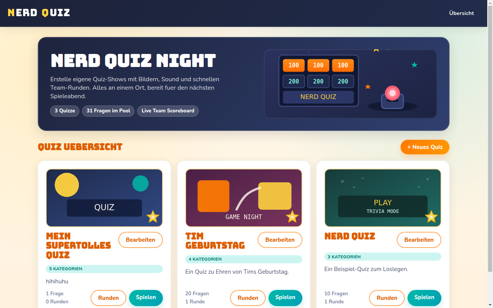
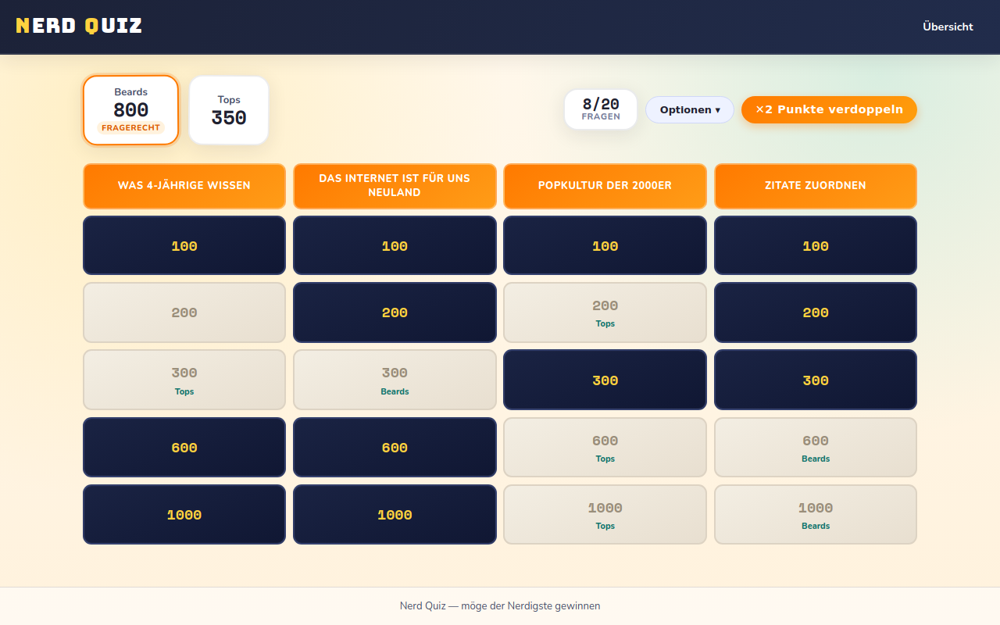

# Nerd Quiz

## Eigenes Quiz erstellen und durchführen

### Was du brauchst

1. `git`: z.B. über [git for Windows](https://git-scm.com/install/windows)
2. `uv`: [Installation Docs](https://docs.astral.sh/uv/getting-started/installation/)
   1. Hierüber wird Python installiert, damit brauchst du Python nicht separat zu installieren.

### Schritte zum Erstellen eines eigenen Quiz

1. Repository clonen: `git clone https://github.com/sHooPmyWooP/nerd-quiz.git`
2. In das Verzeichnis wechseln: `cd nerd-quiz`
3. Abhängigkeiten installieren: `uv sync`
4. Datenbank initialisieren: `uv run manage.py makemigrations` & `uv run manage.py migrate`
5. (Optional) Superuser erstellen: `uv run manage.py createsuperuser`
   > Sollte man eigentlich nicht brauchen, aber falls man doch mal ins
   > Admin-Interface will ist das ganz praktisch. Das Admin-Interface ist unter
   > `http://localhost:8000/admin` erreichbar.
6. (Optional) Beispieldaten laden: `uv run manage.py loaddata quizzes/*.yaml`
   > Ich fand es ganz angenehm die Quizzes direkt in YAML zu erstellen, aber es
   > geht auch einfach über den Quiz-Wizard im Frontend. Ansonsten hat man mit
   > den Beispieldaten direkt ein paar Quizzes zum Testen, ohne erst welche
   > erstellen zu müssen.
7. Server starten: `uv run manage.py runserver`
   >Das Quiz ist jetzt unter `http://localhost:8000` erreichbar, die Menüführung
   >ist hoffentlich selbsterklärend. Viel Spaß beim Erstellen und Durchführen
   >deines eigenen Nerd-Quiz!
